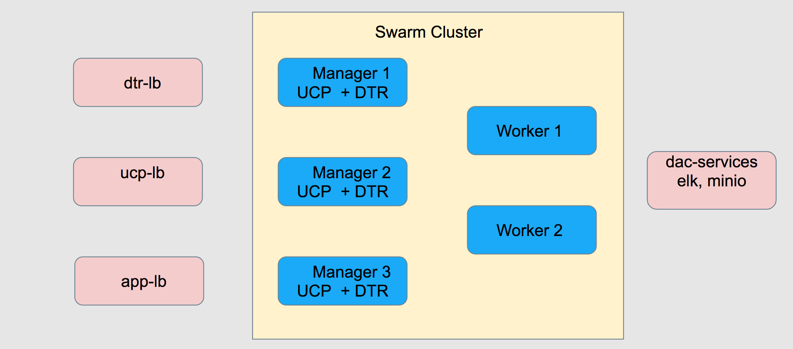
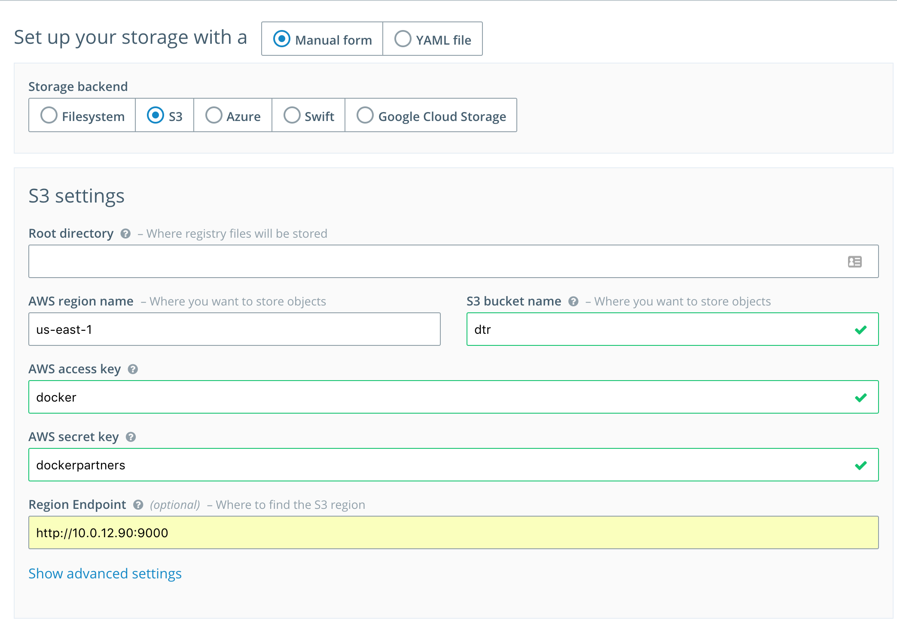

## Setup Details

**Lab Setup**

- Each team will consist of 3-4 individuals.
- Each team will receive a setup of its own which will include:
  
  * Own VPC, private and public subnet, security groups..etc
  * 9 Nodes
	 - `manager-node0`: Cluster Manager Node to have UCP manager and DTR replica
	 - `manager-node1`: Cluster Manager Node to have UCP manager and DTR replica
	 - `manager-node2`: Cluster Manager Node to have UCP manager and DTR replica
	 - `worker-node-0`: Worker Node
	 - `worker-node-1`: Worker Node
	 - `lb-0`: UCP Loadbalancer
	 - `lb-1`: DTR Loadbalancer
	 - `lb-2`: Application/HRM Loadbalancer
	 - `services`: Used for ELK and Minio services
  * Private SSH key to be used to ssh into all nodes
  * Let's Encrypt Certificates for your DNS records ( details below )
  * Nodes are using **Centos 7** as their base OS.
  * Username to access nodes is **centos** ( e.g `ssh -i <YOUR PRIVATE KEY>.pem centos@<PUBLIC_IP>`

**DNS Records:**

	Team 1:
	`dac-lb-0`: `ucp.team1.dac.dckr.org`
	`dac-lb-1`: `dtr.team1.dac.dckr.org`
	`dac-lb-2`: `*.app.team1.dac.dckr.org` 
	Team 2:
	`dac-lb-0`: `ucp.team2.dac.dckr.org`
	`dac-lb-1`: `dtr.team2.dac.dckr.org`
	`dac-lb-2`: `*.app.team2.dac.dckr.org` 
	Team 3:
	`dac-lb-0`: `ucp.team3.dac.dckr.org`
	`dac-lb-1`: `dtr.team3.dac.dckr.org`
	`dac-lb-2`: `*.app.team3.dac.dckr.org` 
	Team 4:
	`dac-lb-0`: `ucp.team4.dac.dckr.org`
	`dac-lb-1`: `dtr.team4.dac.dckr.org`
	`dac-lb-2`: `*.app.team4.dac.dckr.org` 
	Team 5:
	`dac-lb-0`: `ucp.team5.dac.dckr.org`
	`dac-lb-1`: `dtr.team5.dac.dckr.org`
	`dac-lb-2`: `*.app.team5.dac.dckr.org` 

# Lab 1

**Goal:** Create a Swarm Cluster configured with recommended logging and device-mapper configuration. 

Documentation Reference: https://docs.docker.com/engine/swarm/

   * Configure recommended `devicemapper` on atleast one manager node.  
   	* Documentations [here](https://docs.docker.com/engine/userguide/storagedriver/device-mapper-driver/#configure-direct-lvm-mode-for-production)
    * This is the best practices for all `centos`/`rhel` based systems. For sake of time you're required to do the manager nodes only.
* Verify engine config and restart engine
* Set up 3-node swarm with 3-managers and 2 workers.
* Set up engine logging 
	*  Documentation [here](https://github.com/nicolaka/elk-dee)
	*  ELK is already set up for you on the `dac-services` node. You only need to do *Steps 2-4*. 
* Finally, confirm that you have logging working, full swarm setup with device-mapper and logging configured. 

# Lab 2

 **Goal:**  Install and configure highly available UCP
  
**Documentation Reference:** https://docs.docker.com/datacenter/ucp/2.1/guides/admin/install/

* Install UCP version `2.1.0` on top of existing swarm cluster
  * UCP needs to listen on non-standard port `12390` (using `--controller-port 12390` )
  * Make sure you add the correct SANs. One SAN should be the FQDN for your ucp (e.g `--san ucp.team1.dac.dckr.org`) and the other SAN should be the public IP of the node.
  * Make sure you can access UCP using the public IP of the node after installation is complete.
  * Install your license.
* Deploy HAPROXY on UCP LB node (`dac-lb-0`)
	* HAPROXY needs to listen on ports 80/443 and forward to non-standard port of UCP. Please use port *12390* as the backend port. 
	* Reconfigure `ucp-haproxy.cfg` config file available in this directory with your setup's info by substituting `MANAGER_IP` in the config file. The launch the haproxy container using `docker run -d -p 443:443 -p 8181:8181 --restart=unless-stopped --name ucp-lb -v ${PWD}/ucp-haproxy.cfg:/usr/local/etc/haproxy/haproxy.cfg:ro haproxy:1.7-alpine haproxy -d -f /usr/local/etc/haproxy/haproxy.cfg`
* Install external certs using the provided certs and confirm that you can establish an HTTPS connection in your browser ( may require incognito session/hard refresh)
* Set up HRM on standard ports 80 and 443.
* Set up node labels
      - [documentation](https://docs.docker.com/engine/swarm/manage-nodes/#change-node-availability)
      - Label the two worker nodes as `environment=staging` and `environment=production`
      - Label the two worker nodes with their availability zones ( you can find an instance availability zone using `curl http://169.254.169.254/latest/meta-data/placement/availability-zone`). e.g `zone=us-west-2a`
* Perform a UCP backup
  * [Documentation](https://docs.docker.com/datacenter/ucp/2.1/guides/admin/backups-and-disaster-recovery/#backup-command)
* Upgrade UCP to version `2.1.1`
* Finally, ensure that you have a fully functioning UCP cluster composed of three manager nodes and two worker nodes. 

# Lab 3

**Goal:** Application Deployment Operations

* Deploy NGINX on application LB node (`dac-lb-2`) to be used to route application traffic to worker nodes
	* NGINX needs to listen on ports 80/443 and forward to standard HRM ports (80/443).
	*  Reconfigure `app-nginx.conf` config file available in this directory with your setup's info by substituting `MANAGER_IP` in the config file. Then launch the nginx container using `docker run -d -p 80:80 -p 443:443 --restart=unless-stopped --name app-lb -v ${PWD}/app-nginx.conf:/etc/nginx/nginx.conf:ro nginx:stable-alpine`

# Lab 4

**Goal:** Install and configure highly available DTR

* Deploy HAPROXY on LB node for DTR (`dac-lb-1`)
	* HAPROXY needs to listen on ports 80/443 and forward to non-standard port of UCP. Please use port *12391* for HTTP and *12392* for  HTTPS.
	*  Reconfigure `dtr-haproxy.cfg` config file available in this directory with your setup's info by substituting `MANAGER_IP` in the config file. The launch the haproxy container using `docker run -d -p 443:443 -p 8181:8181 --restart=unless-stopped --name ucp-lb -v ${PWD}/dtr-haproxy.cfg:/usr/local/etc/haproxy/haproxy.cfg:ro haproxy:1.7-alpine haproxy -d -f /usr/local/etc/haproxy/haproxy.cfg`
* Install DTR Version `2.2.2`
	* Install three DTR replicas on the Manager nodes
	* Make sure to use correct external url. This should be your DTR's FQDN. 
	* Make sure to use non-standard ports *12391* for HTTP and *12392* for  HTTPS for **each** replica using the `--replica-http-port` and `--replica-https-port` flags.
* Configure external cert and confirm you can establish HTTPS using your browser.
* Configure Storage Backend.
	* Minio, an S3 Compatible Object storage, is configured already on the `dac-services` node. Please use the following configuration to set it up.
	* Go to $DAC_SERVICES_PUBLIC_IP>:9000
	* Create a Bucket (lower right corner) and call it `dtr`
	* Go back to DTR URL, and go to **Settings** > **Storage**.
	* Select S3 and provide the required parameters. Make sure to use your own `dac-services` private IP as the **Region Endpoint** Here's a sample configuration:
	
	* Confirm your configuration worked:
		* Create your first repository under the `admin` namespace.
		* Perform a `docker login` from your local Docker client.
		* Perform a docker push to confirm that storage backend is configured. 
* Set up Docker Security Scanning 
* Backup DTR
	* [Documentation](https://docs.docker.com/datacenter/dtr/2.2/guides/admin/backups-and-disaster-recovery/)
* Upgrade DTR to 2.2.3
* Redeploy the Pets App using images on DTR
	* Create the repos on DTR
	* Set up Docker Security Scanning for the images
	* Push the images to DTR
	* Redeploy the application by updating the images (`docker service update`)

* Finally, ensure that you have a fully functioning DTR cluster composed of three replicas, configured with proper external certs, object storage, and the Pets app is deployed using DTR-based images.

